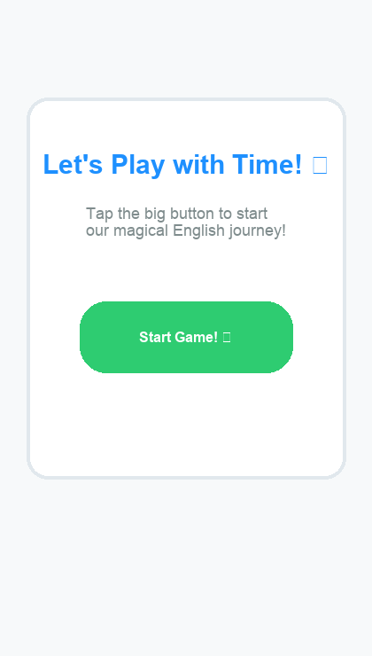
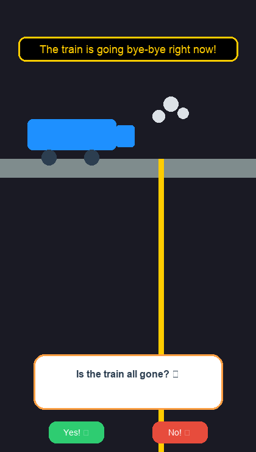
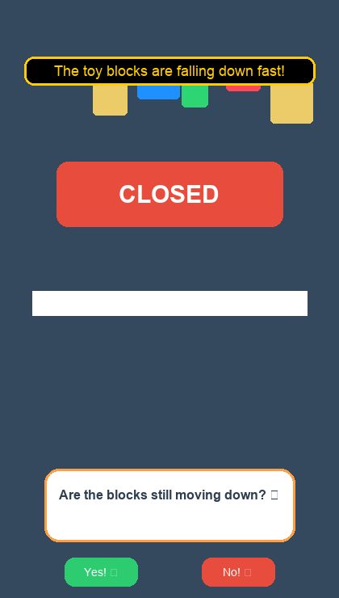
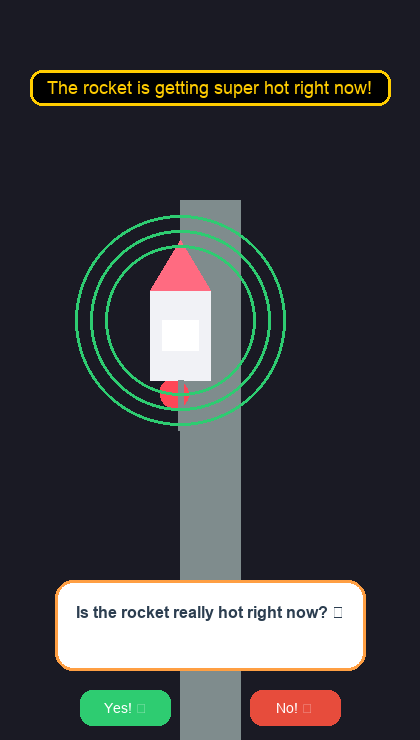

# Tense Edge Kids Playground 🚀

An interactive web-based educational application designed for native 5-year-old children to intuitively acquire English tenses and aspects through cognitive grammar principles.

## 🛠️ Tech Stack & Architecture

- **Rendering Engine:** HTML5 Canvas Frame-by-Frame Procedural Rendering (60 FPS via `requestAnimationFrame`).
- **Audio Engine:** Dynamic sound synthesis and morphological filtering via Web Audio API (`AudioContext`).
- **Core Methodology:** "Tense Edge" spatial-temporal boundary checking coupled with non-translational binary Concept Checking Questions (CCQs).

## 📁 Repository Structure

- `index.html`: Unified mobile viewport markup with high-resolution canvas.
- `style.css`: Viewport constraints and centering styles.
- `script.js`: Core game loop, physical coordinate logic, state machine, and synth circuits.
- `agent.md`: AI Agent memory and contextual persistence handbook.
- `docs/`: In-depth cognitive curriculum design specifications.

## 🚀 How to Run

1. Clone this repository to your local machine.
2. Open `index.html` directly in any modern desktop or mobile web browser.
3. Tap **"Start Game! 🎉"** to bypass browser autoplay security protocols and initialize the synthesizer.

## 📸 Screenshots

### Start Screen

### Adventure 1: Train Platform

### Adventure 2: Toy Factory

### Adventure 3: Rocket Launchpad

